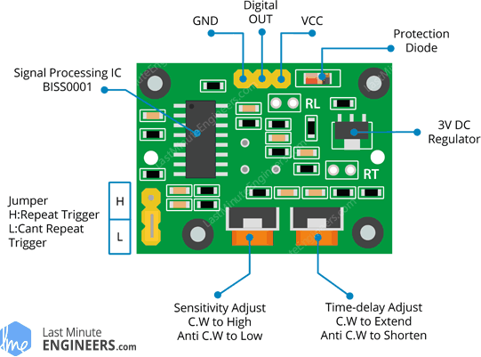

# NodeMCU Weather Station Project

This project contains the code I used to run a simple weatherstation Arduino project.
It uses an LCD to display temperature and humidity as well as having a motion sensor that activates a servo motor.

For our project it was also made to post this data to a webserver, but if you are running the system on your own this is obviously not possible.

If you want details on how I built this project and how you could build your own, please check out this write-up I made that is now conveniently uploaded to Google Drive: 

Parts list:
===========

The weather station requires a lot of parts, this section has a list of
them as well as their purpose.

-   ESP8266 NodeMCU: the main unit that powers our weather station, has
    WiFi connectivity built-in

-   1602A LCD: Used for displaying basic data

-   I2C adapter board: soldered onto 1602A LCD, has a controller that
    lets us easily interact with the display

-   DHT11 sensor: Measures temperature and humidity

-   Tower Pro SG90 Servo: Will be used to operate the door

-   HC-SR501 PIR Motion Sensor: Will be used to sense when a user nears
    the weather station to then activate the display and servo motor.

-   Large Breadboard

-   Four Male to Female breadboard cables

-   Eight Male to Male breadboard cables

-   To Be Determined: Some kind of Anemometer

Hooking it up: Instruction details
==================================

For setting up the NodeMCU weatherstation properly we need to pay
attention to a number of details. We need to make sure the data
connections align with the definitions in code.\
It is also important we use the right settings in the Arduino IDE.\
Ensure that you have the ESP8266 library installed by adding it in the
board manager.@IDE\
\
Then select “NodeMCU 1.0 (ESP12-E)” under tools \> board.\
After setting up these basics we can start setting up all these parts.

-   1602A LCD (with I2C adapter!)

-   DHT11 sensor

-   SG90 servo

-   PIR motion sensor

1602A LCD setup
---------------

To properly set up the LCD we first need to check whether this LCD
already has an I2C adapter. Look at the back of the LCD and check if the
following board is attached to it:

If this is the case we can continue with setting up the LCD.\
If not you will need to check online and purchase an I2C adapter.\
This will need to be soldered to the LCD.\
The process is fairly simple, simply slide the adapter through the pin
holes on the LCD, first solder the far left and right pins to ensure it
stays in place and then solder the rest of the pins.\
After doing this we can now start with the connection of the LCD and the
NodeMCU.\
\

Hook up the four LCD pins as follows (using male to female cables):

-   Ground to Ground

-   VCC to the VIN pin on NodeMCU (feeds 5V directly from USB, be
    careful with this)

-   SDA to pin D2

-   SCL to pin D1

After doing so we can test whether the I2C device is properly detected
by our NodeMCU. We do this by using an I2C scanner sketch.@scanner

If your device is detected, congrats, you set up the LCD in the right
way! Be sure to check and note the memory address, this will be needed
later.\
As a final setup step, add the I2C library by “Frank de Brabander”
through your Arduino IDE’s library manager, we use this to send data to
the LCD.

DHT11 setup
-----------

The DHT11 sensor is luckily much easier to set up than the LCD. Hook it
up as follows into the breadboard with male to male pins:

-   PIN 1: VCC to 3.3V

-   PIN 2: Data to D4

-   PIN 3: unused

-   PIN 4: Ground to Ground

-   Install the DHT sensor library with the IDE library manager.

SG90 servo setup
----------------

The servo is also relatively easy to set up. Using male to male cables
we can hook it up as follows:

-   Brown cable to ground

-   Red cable to VIN 5V

-   Yellow to data pin D5 the Servo library in the library manager.

PIR motion sensor setup
-----------------------

The final component is the PIR sensor. This sensor is very simple, it
simply sends a “high” signal when something is detected and a “low”
signal otherwise.\
Also install the Adafruit unified sensor library.

Hook up VCC to VIN, GND to Ground and digital OUT to data pin D6.\
Then make sure the header is set to “H”.\
You can use the two potmeters to adjust the time the sensor keeps
outputting a “HIGH” signal (ranging from a few seconds to about 7-10
minutes) and the amount of movement it takes to trigger a “HIGH” state.\
Set the time potmeter completely counterclockwise so it only stays
active for a few seconds.\
Leave the sensitivity meter as is unless you have trouble detecting
motion, in that case you might want to adjust it.

Code sketch: running it
-----------------------

After setting up all these sensors you can use my code to run the
complete weather station. As is normal for development I recommend
testing components separately before running the entire program with all
sensors and the LCD. 
